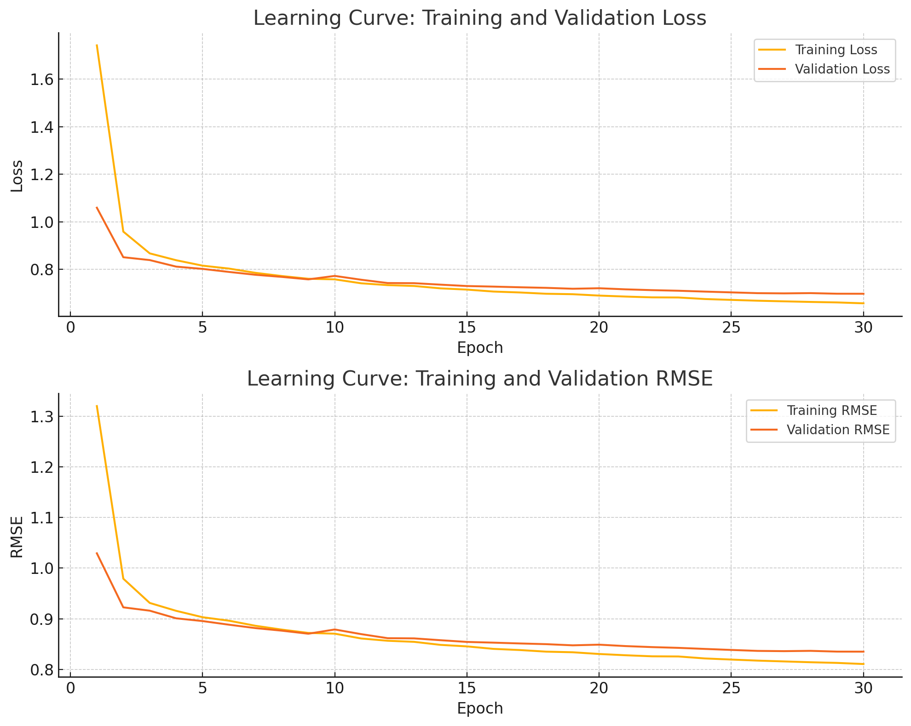

# Movie Recommendation System using Autoencoder

This project implements a movie recommendation system using an Autoencoder to predict and recommend movies to users. The dataset used is a subset of the Netflix Prize dataset, which includes user ratings for movies.   
   
## Table of Contents

- [Introduction](#introduction)
- [Collaborative Filtering](#collaborative-filtering)
- [Autoencoder Models](#autoencoder-models)
- [Dataset](#dataset)
- [Model Architecture and Hyperparameters](#model-architecture-and-hyperparameters)
- [Training and Validation](#training-and-validation)
- [Results](#results)
- [Prediction and Recommendation](#prediction-and-recommendation)
- [References](#references)

## Introduction

This project aims to build a movie recommendation system based on user ratings using an Autoencoder model. The primary goal is to predict and recommend movies that users are likely to enjoy based on their past ratings and the ratings of similar users.

## Collaborative Filtering

Collaborative Filtering (CF) is a technique used in recommendation systems where the preferences of users are predicted based on the preferences of other users. CF systems can be user-based, where similar users are identified, or item-based, where similar items (movies) are identified. In this project, we use a user-based CF approach.

## Autoencoder Models

An Autoencoder is a type of artificial neural network used to learn efficient latent features of input data. The network consists of two main parts:
- **Encoder**: Compresses the input into a latent-space representation.
- **Decoder**: Reconstructs the input from the latent space.

By training the Autoencoder on user ratings, we can learn a compact representation of users' preferences and use it to predict ratings for movies that the users haven't seen.

## Dataset

The dataset used is a subset of the Netflix Prize dataset. Due to the computational requirements, only a quarter of the dataset is used for training.   
This dataset includes user ratings for various movies. The ratings range from 1 to 5, and users have not rated all movies. We use the following data preprocessing steps:    
1. Loading the dataset.
2. Creating a sparse user-movie matrix.
3. Splitting the data into training (80%) and testing (20%) sets.

### Dataset Information:
- Number of users: 470,758
- Number of movies: 4,499
- Total number of ratings: 24,053,764
- Sparsity: 0.0114

## Model Architecture and Hyperparameters

The Autoencoder model consists of the following layers:

### Encoder:
- Linear layer with 512 units, ReLU activation, and Dropout
- Linear layer with 256 units, ReLU activation, and Dropout
- Linear layer with 64 units, ReLU activation

### Decoder:
- Linear layer with 256 units, ReLU activation, and Dropout
- Linear layer with 512 units, ReLU activation, and Dropout
- Linear layer with input dimension units, ReLU activation

### Hyperparameters:
- **Encoding Dimension**: 64
- **Dropout Rate**: 0.1
- **Learning Rate**: 0.0001
- **Weight Decay**: 1e-5
- **Early Stopping Patience**: 1
- **Batch Size**: 128
- **Epochs**: 30
- **Loss Function**: Mean Squared Error (MSE)
- **Optimizer**: Adam with L2 regularization

## Training and Validation

The model is trained for 30 epochs with the following results:

| Epoch | Training Loss | Training RMSE | Validation Loss | Validation RMSE |
|-------|---------------|---------------|-----------------|-----------------|
| 1     | 1.7422        | 1.3199        | 1.0592          | 1.0292          |
| 2     | 0.9587        | 0.9791        | 0.8509          | 0.9225          |
| 3     | 0.8671        | 0.9312        | 0.8389          | 0.9159          |
| ...   | ...           | ...           | ...             | ...             |
| 28    | 0.6628        | 0.8141        | 0.6999          | 0.8366          |
| 29    | 0.6607        | 0.8128        | 0.6974          | 0.8351          |
| 30    | 0.6570        | 0.8106        | 0.6972          | 0.8350          |

## Results

The model was trained for 30 epochs, achieving the following results:

- **Best Training Loss**: 0.6570
- **Best Training RMSE**: 0.8106
- **Best Validation Loss**: 0.6972
- **Best Validation RMSE**: 0.8350

## Prediction and Recommendation

A separate script is used for predicting or recommending 10 movies for a new user who has rated only some of the movies. The recommendation is based on what the user has already rated and what similar users have rated. Since this is a CF system, the recommendations are generated based on the similarities between users.
